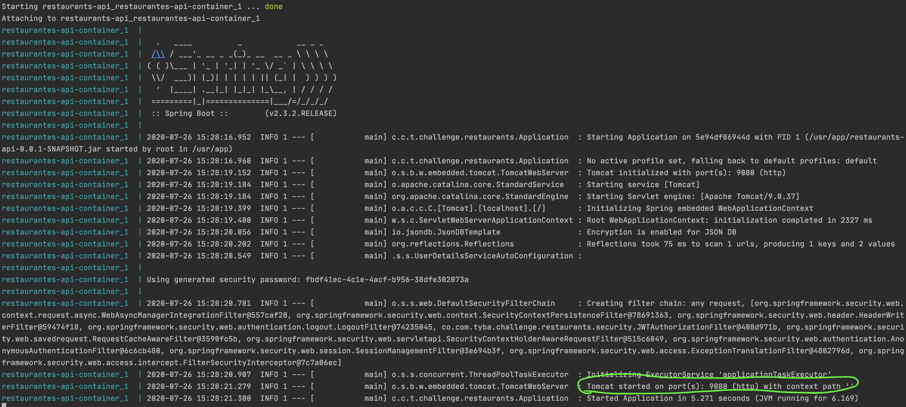
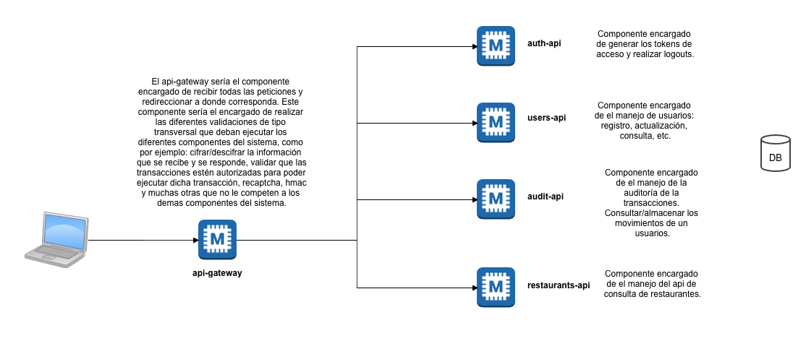

# Restaurantes API

Version preliminar de la solucion al desafio de tyba para desarrolladores backend utilizando spring boot.

Todos los servicios expuestos quedaron en un unico microservicio. Sin embargo, al final de este documento se expone un diagrama en el cual de acuerdo a la consideracion del autor se debe resolver este desafio.

Se utilizo la version free del api de zomato 'https://developers.zomato.com/documentation?lang=es_cl' para la consulta de restaurantes por ciudad o coordenadas.

## Recursos de Autenticacion 

Para poder acceder a los servicios expuestos por el microservicio, primero se debe realizar la respectiva autenticacion y obtener un token de acceso. 

* [Login](docs/login.md) : `POST /auth/login`

### Servicios

Token is provided with the request:

* [Buscar Restaurantes](docs/restaurants.md) : `GET /restaurants/search`
* [Consultar Transacciones](docs/transactions.md) : `GET /restaurants/transactions`
* [Registrar Usuario](docs/register-user.md) : `POST /user/register`

### Construir Aplicacion
* Descargar proyecto
```
git clone git@github.com:ronaltrianat/restaurantes-api.git
```

* Compilar proyecto java con gradle(instalar gradle y java):
```
gradle clean build
```
* Iniciar proyecto localmente con docker compose
```
docker-compose up
```
Al arrancar el proyecto se puede validar que arranco correctamente si sale el mensaje 
`Tomcat started on port(s): 9080 (http) with context path ''`



---
* Validar funcionamiento de los servicios

##### Registrar Usuario
```
POST http://localhost:9080/user/register HTTP/1.1
> Content-Type: application/json
> Accept: */*

| {
| 	"username":"user",
| 	"password":"123456"
| }

* Response

< HTTP/1.1 200 
< Content-Type: application/json
< Transfer-Encoding: chunked

| {
|   "success": true,
|   "message": "User successfully registered."
| }
```
##### Login
```
POST http://localhost:9080/auth/login HTTP/1.1
> Content-Type: application/json
> Accept: */*

| {
| 	"username":"user",
| 	"password":"123456"
| }

* Response

< HTTP/1.1 200 
< Content-Type: application/json
< Transfer-Encoding: chunked

| {
|   "success": true,
|   "message": null,
|   "token": "Bearer *************************"
| }
```

##### Consulta de Restaurantes
```
GET http://localhost:9080/restaurants/search?city_id=2809 HTTP/1.1
> Authorization: Bearer *************************
> Accept: */*

* Response

< HTTP/1.1 200 
< Content-Type: application/json
< Transfer-Encoding: chunked

| {
|   "success": true,
|   "message": null,
|   "establishments": [
|     {
|       "establishment": {
|         "id": 21,
|         "name": "Quick Bites"
|       }
|     },
|     {
|       "establishment": {
|         "id": 7,
|         "name": "Bar"
|       }
|     },
|     {
|       "establishment": {
|         "id": 16,
|         "name": "Casual Dining"
|       }
|     },
|     {
|       "establishment": {
|         "id": 41,
|         "name": "Beverage Shop"
|       }
|     },
|     {
|       "establishment": {
|         "id": 295,
|         "name": "Noodle Shop"
|       }
|     }
|   ]
| }
```
##### Consulta de Transacciones
```
POST http://localhost:9080/restaurants/transactions HTTP/1.1
> Authorization: Bearer *************************
> Accept: */*

| {
| 	"username":"user",
| 	"password":"123456"
| }

* Response

< HTTP/1.1 200 
< Content-Type: application/json
< Transfer-Encoding: chunked

| {
|   "success": true,
|   "message": null,
|   "transactions": [
|     {
|       "id": 1595779363377,
|       "params": "{city_id=[2809]}",
|       "username": "user"
|     }
|   ]
| }
```
---
### Propiedades de configuracion del proyecto
```
server:
  port: 9080 -> Puerto en el cual inicia el microservicio.

api:
  zomato: -> Propiedades del servicio externo de restaurantes
    uri-establishments: https://developers.zomato.com/api/v2.1/establishments -> Url que para la consulta de restaurantes por id de ciudad o coordenadas.
    api-key-name: user-key -> Nombre del header donde se envia el api-key de acceso al api
    api-key-value: 1253ecfe4cce84f6723ef97c2780e4b3 -> Contenido del api-key de acceso al api
  database:
    files-location: database -> Nombre del directorio donde se almacena la informacion en archivos json
    key-cipher: 1r8+24pibarAWgS85/Heeg== -> Llave de cifrado de datos sensibles en la db local
  jwt:
    id: tybaChallengeJWT -> Id de generacion del token jwt
    secret-key: tybaSecretKeyJWT -> Llave secreta para generacion de token jwt.
    expiration-millis: 600000 -> Tiempo de expiracion del token en milisegundos.
  messages: -> Configuracion de mensajes de respuesta para para operacion del microservicio.
    login:
      'user-does-not-exist': 'User does not exist.'
      'invalid-credentials': 'Invalid credentials.'
      default: 'Nuestros sistemas están fallando. Te invitamos a intentarlo más tarde.'
    restaurants:
      'search-parameters-are-invalid': 'Search parameters are invalid.'
      default: 'Nuestros sistemas están fallando. Te invitamos a intentarlo más tarde.'
    user:
      'user-successfully-registered': 'User successfully registered.'
      'user-already-exists': 'User already exists.'
      default: 'Nuestros sistemas están fallando. Te invitamos a intentarlo más tarde.'
    defaultError: 'Nuestros sistemas están fallando. Te invitamos a intentarlo más tarde. (2)'
```


### Diagrama Pensado para Resolver Desafio
 
* [Repositorio en construccion](https://github.com/ronaltrianat/tyba-challenge)

